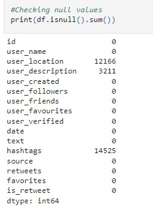
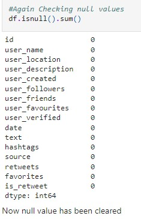
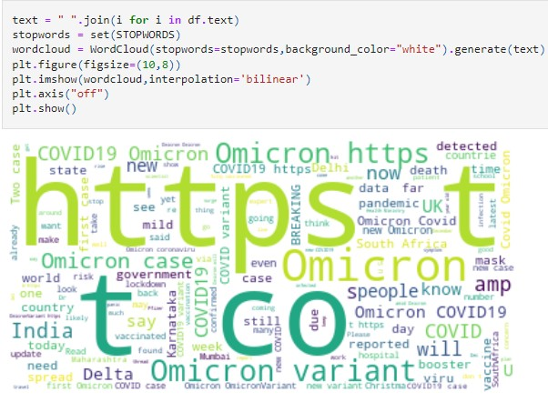
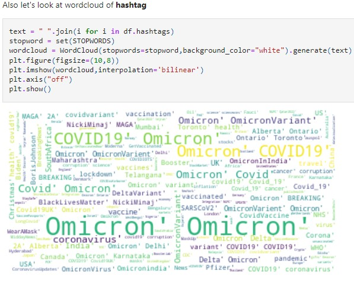
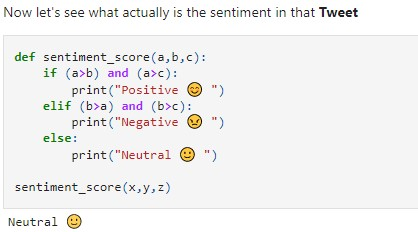

# Twitter-Sentiment-Analysis

# What is this project all about?
- Recently **WHO** has declared **Omicron** as a varient of **Concern** on their **Twitter** account, so this project passes a light on how people are reacting to this post. This   analysis will show whether they are reacting in **negative** or in **positive** way or in **neutral** way.

# Dataset
- Data are collected from [Kaggle](https://www.kaggle.com/gpreda/omicron-rising), which is a **tweet** that people have made after **WHO** **tweet** the post.

# Data Preprocessing and Cleaning
- First we clean a null value by dropping it since there is large amount of data.
- 
- 
- After cleaning text data using **NLTK module and regular expression** and by importing **Stopwords**, **wordcloud** looks like:
- 
- 

# What is used to Calculate Sentiment Score -->> VADER Lexicon
- VADER ( Valence Aware Dictionary for Sentiment Reasoning) is a model used for text sentiment analysis that is sensitive to both polarity (positive/negative) and intensity         (strength) of emotion. It is available in the NLTK package and can be applied directly to unlabeled text data. VADER sentimental analysis relies on a dictionary that maps         lexical features to emotion intensities known as sentiment scores. The sentiment score of a text can be obtained by summing up the intensity of each word in the text. For         example- Words like 'love', 'enjoy', 'happy', 'like' all convey a positive sentiment. Also VADER is intelligent enough to understand the basic context of these words, such as     "did not love" as a   negative statement. It also understands the emphasis of capitalization and punctuation, such as "ENJOY".
# What SentimentIntensityAnalyzer do?
- Give a sentiment intensity score to sentences.

# What polarity_score do?
- Return a float for sentiment strength based on the input text. Positive values are positive valence, negative value are negative valence.

# Result
- Here we find majority of people are neutral, that's amazing thing why? In such a critical post people are not reacting but they are sharing information.
- 
