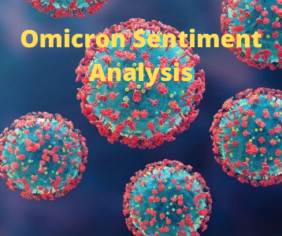

# Twitter-Sentiment-Analysis

# What is this project all about?
- Recently **WHO** has declared **Omicron** as a varient of **Concern** on their **Twitter** account, so this project passes a light on how people are reacting to this post. This   analysis will show whether they are reacting in **negative** or in **positive** way or in **neutral** way.

# Dataset
- Data are collected from [Kaggle](https://www.kaggle.com/gpreda/omicron-rising), which is a **tweet** that people have made after **WHO** **tweet** the post.

# Data Preprocessing and Cleaning
- First we clean a null value by dropping it since there is large amount of data.
 
